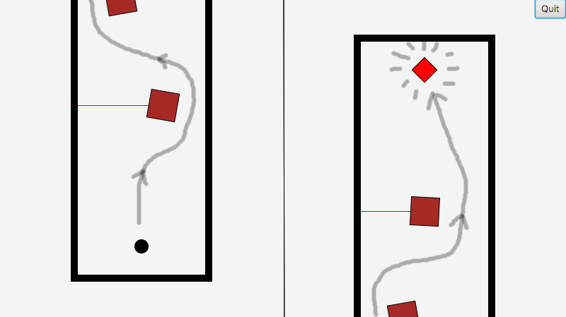

# Project Thief Demo

## Description:
Project Thief Demo is a very basic game that demonstrates my ability to work with object oriented programming. You play as a thief that tries to steal a gem from a bank filled with security lasers. Imagination required.

## Purpose:
As a final project for my CSCI 1110 class at Southwest Technical College, this program showcases a chunk of what I learned throughout the class in a single project.

## How to use:
Use the arrow keys to navigate and any available buttons in the GUI to perform actions. The goal of the game is to reach the end of the hallway and grab the red 'gem' to display the win screen.


## Code Example:
This is an example of some code that implements player movement. The PrevX and PrevY are for collision mechanics in other parts of the program. As it is, movement is a little annoying. A solution to this would be to instead have a toggle on when pressed and toggle off when released type of movement system setting the speed and direction.
```

```
